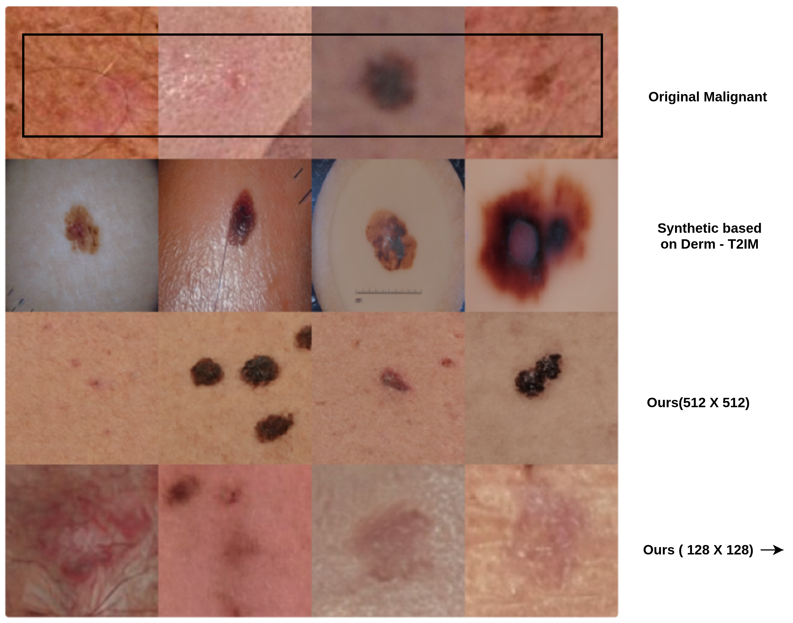
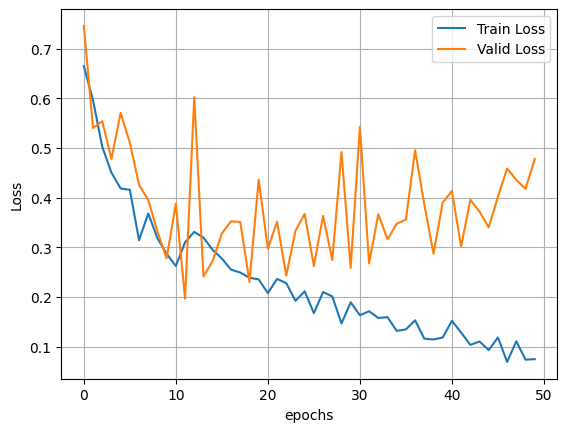
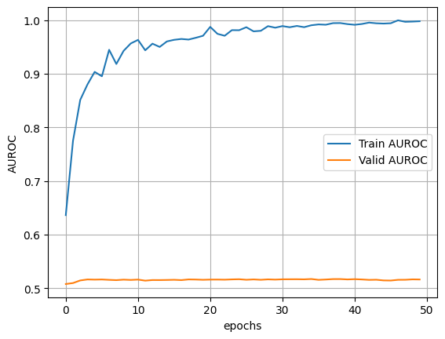
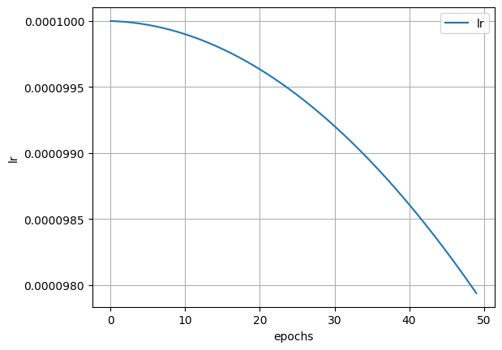

# Skin Cancer Detection from 3d Total body photos
We have implemented this solution using ensmble of vit-base and edgenext_base model. To help the model learn robust feature we used diffusion models to generate images.

# For training we used A100(40GB) gpu.

## Our Result

### Figure 1: Data set

### Figure 2: Training Loss

### Figure 3: AUROC Curve

### Figure 3: AUROC Curve

 

