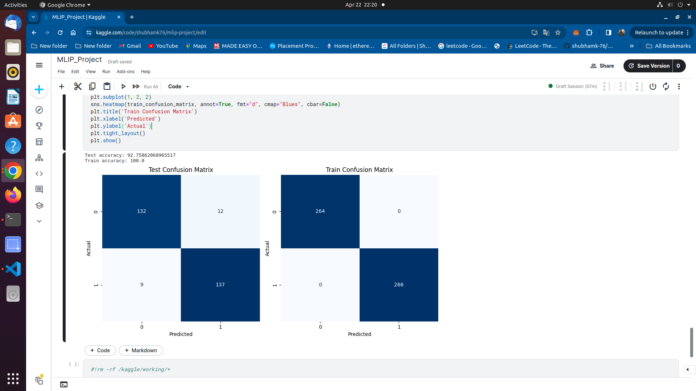
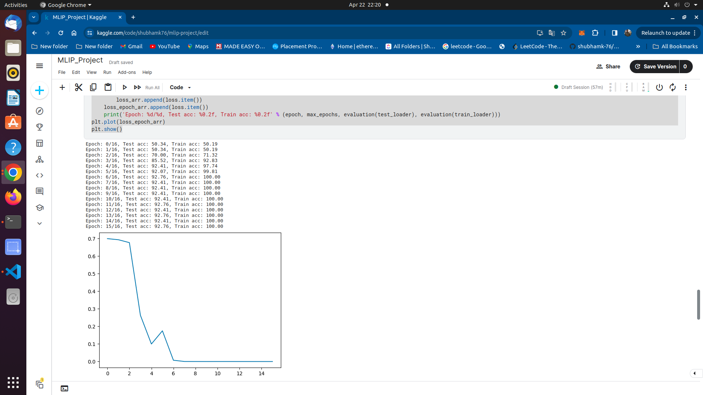
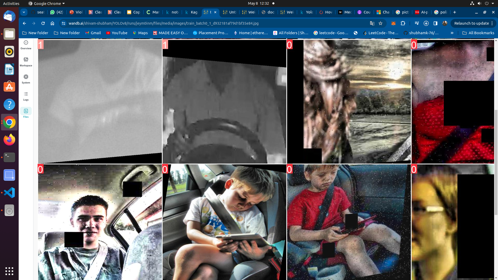
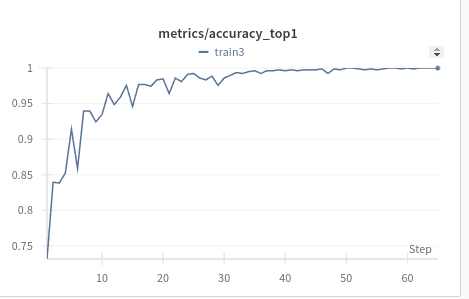

# Project Title

Classification of seat-belt and no seat-belt in low quality images.

## Description

In this project we have tried mainly two algorithms YOLOv8n and ViT for classification of seat-belt usage.

### Installing

* pip install ultalytics
* pip install torch torchvision
* pip install matplotlib numpy panda 


### Executing program

* How to recreate our work
```
1. Replace the folder name with your current folder and run mlip-yolov8.ipynb
2. Similaly we have tried our coustom model SeatNet, to run it execute SeatNet.ipynb
3. We have also tried ViT base model.
```
## Authors
1. Shubham Kumar 

## Our Result
### 1. Performance of yolov8.

 



### 2. Train Accuracy



